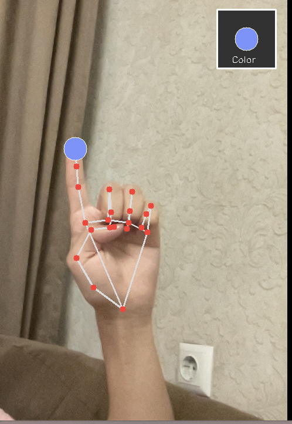
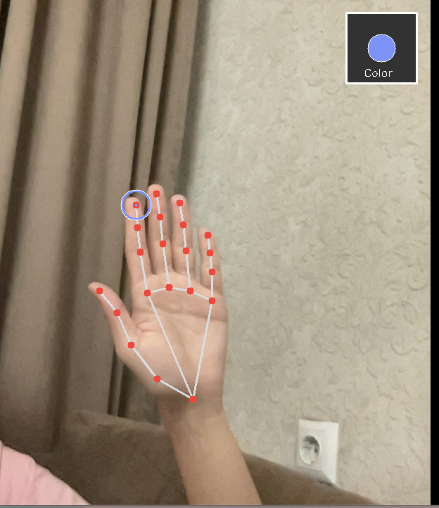
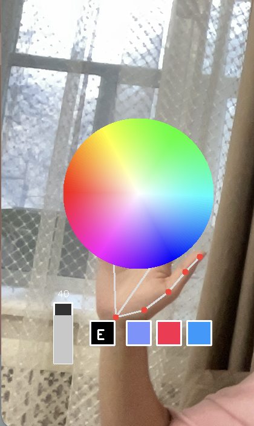
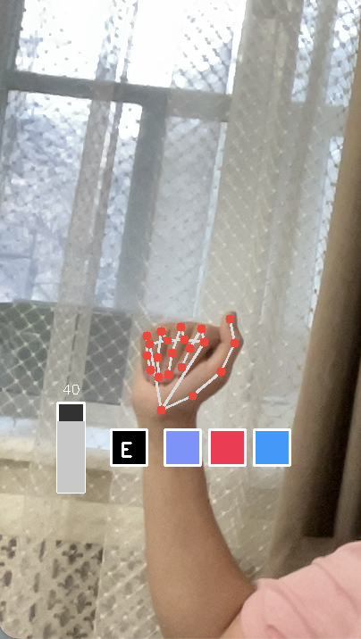

# Finger Drawing

Finger Drawing is, as it may sound, a software made for experimenting with freeform drawing without any surfaces via Computer Vision recognition of user's hand gestures. The experience is working fully with hand motion capturing, meaning that you will have no need for your keyboard or mouse (except for quitting and saving the image).

## Key Features
* **Hands-on Style UI:** All tools are attached to your hand and move with you in real-time.
* **Dynamic Color Wheel:** A mathematically generated HSV color picker that allows for precise color selection. Appears only when whole palm is opened.
* **Smart Gestures:**
    * **Draw:** Extend your Index finger (keep others closed).
    * **Hover/Aim:** Open your hand (or atleast the middle finger) to move the "Ghost Cursor" without drawing.
* **Size Slider:** Slide your finger along a virtual bar to adjust brush thickness.
* **HUD:** A status box in the top-right corner showing your active color and brush size.

## Technical Implementation
This project relies on computer vision to map 2D coordinates from the camera to a virtual canvas.

* **Python**
* **OpenCV (`cv2`)**: Handles image processing, drawing the UI elements, and overlaying the canvas on the video feed.
* **MediaPipe**: Google's machine learning framework used for high-speed, accurate hand tracking. It provides the 21-point hand skeleton landmarks.
* **NumPy**: Used for efficient matrix operations, particularly for generating the mathematical HSV color wheel and handling image arrays.


## Prerequisites
Code is fully done on Python, so ensure you have it installed. You will need the following libraries:

```bash
pip install opencv-python mediapipe numpy
```

Additionally the file "hand_landmarker.task" is essential for the correct working of MediaPipe and should be located in the same folder as the "main.py" (It can also be downloaded from official MediaPipe page)


## How to run
1) Clone this repository:

```bash
git clone [https://github.com/Frogchipjar/MediaPipe-FingerDrawing.git](https://github.com/Frogchipjar/MediaPipe-FingerDrawing.git)
cd MediaPipe-FingerDrawing
```

2) Install dependencies (if you haven't yet)
   
3) Run the main.py
   
4) To quit - press "Q"; to save the image in png - press "S" (it will be saved in this code's folder)


## Controls

**Important!** The hand roles can be easily switched by making adjustments to "handedness" value (line 165). By default right hand is the drawing hand and left hand is a palette hand.

🖌️ Right Hand: The Brush
This Hand is your brush. The app uses Gesture Recognition to know when to paint.

  - To Draw: Point with your Index Finger while keeping your other fingers folded (like making a "number one" sign). You will see a Solid Circle.
    
  
  
  - To Hover: Open your hand or fold them into a fist. You will see a Hollow Ring cursor targeting the canvas, but it won't leave a mark.
    
  


🎨 Left Hand: The Palette
This Hand acts as your artist's palette. When it sees your hand it will show your available instruments:

  - Color Wheel: A generated spectrum floating on your palm when it's opened. Touch it with your drawing hand to pick a color.
    
  
  
  
  - Size Slider: A vertical bar next to your wrist. Slide your finger up/down to change brush size.

  - Eraser: A black button labeled "E". Touch it to switch to the eraser.

  - Recently used: 3 slots showing your recently used colors for quick swapping.

## This project is done for my personal training and enjoyment so it will most likely remain without any updates. If you find it interesting please feel free to reach out to me!
